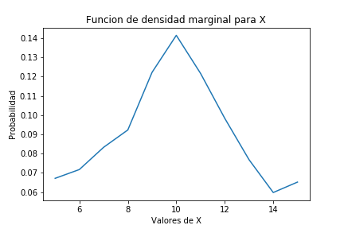
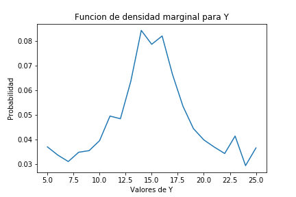
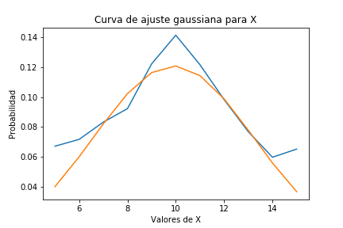
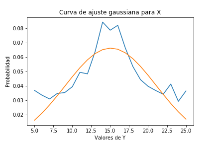
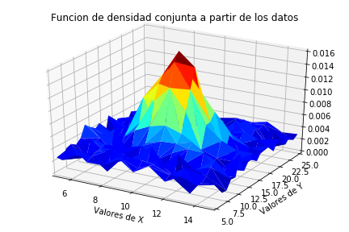

# Tarea3

Este proyecto corresponde a la **_Tarea 3_**, del curso de *Modelos probavilisticos de sistemas y señales* desarrollado por  **Erick Sancho Abarca**, en el cual se trabaja sobre la  *_Variables aleatorias múltiples_*.

## 1. A partir de los datos, encontrar la mejor curva de ajuste (modelo probabilístico) para las funciones de densidad marginales de X y Y.

En este caso se calcula las funciones de densidad marginal de las variables **X** y **Y**, para ello primero se extrae los datos de las variables, empleando una función con la cual se extraen los datos del documento *xy.csv*, por lo tanto se creó una matriz con todos los datos del archivo *xy.csv*. Empleando la librería de numpy se empleó `np.array()`, para crear una matriz con los datos, esto para poder emplear los beneficios que otorga esta librería. Con la matriz se prodeció a extraer los valores de las variabless y almacernarlas en dos vectores, esto empleando las funciones creada para este proposito `separar()` y `separarletra()`, las cuales extraen los valores de las variables **X** y **Y**, con lo cual se puede calcular las funciones de densidad marginal y las curvas de mejor ajuste. 

Primero se graficaron las funciones de densidad de cada variable, esto empleando la función `pyplot` de la librería `matplotlib`, a partir del vector que 
define la los resultados de la función de densidad marginal, la cual se puede obtener empleando la siguiente ecuación:

Donde  es la variale para la cual se está calculando al funcion, y  es la segunda variable en este caso serían "x" y "y" o viceversa, dependiendo de la funcion que se este calculando es ese momento. Entonces a partir de esta ecuación se obtuvo los vectores denominados `sumaX` y `sumaY`, de los cuales se calculó la función de densidad empleando la funcion `pyplot` llamada en el código como `plt`, y el resultado se muestra acontinuación:

Para encontrar la curva de mejor ajuste de la funcion de densidad marginal para cada variable, se emplea la funcion `curve_fit` del módulo `scipy.optimize`, esta función toma como parámetros una función de **_Python_** que calcula la función con la que se desea comparar, y los valores de eje "x" y eje "y", de la función que se quiere ajustar, y devuelve los parámetros que posee la función que se ingresó para comparar. Entonces para obtener la curva de mejor ajuste se compara con las cuatro principales distribuciones las cuales son la "normal", "rayleigh", "exponencial" y "uniforme". Entonces de las gráficas se obtuvo que la curva que mejor se ajusta a esta distribucion en ambos casos es la distribución normal. Entonces la distribucion normal presenta las siguientes ecuaciones, para **X** y **Y**:

Entonces de la funcion `curve_fit()` se obtuvo que para la variable **X** los parametros 
 y  son: `[9.90484381 3.29944287]` 
 respectivamente. y Para la variable **Y** los parametros 
 y  son `[15.0794609   6.02693776]` respectivamente.
 Por lo tanto se obtuvieron las siguientes graficas con ajuste normal para las funciones de densidad marginal de las variables **X** y **Y**:

## 2. Asumir independencia de X y Y, ¿cuál es entonces la función de densidad conjunta que modela los datos?

En este caso se calcula la funcion de densidad conjunta de los datos, la cual es para dos variables una funcion en , donde la entrada son los posibles valores de **X** y **Y**, entonces para este caso dado que se suponen que las variables son independientes se puede emplear la siguiente igualdad la cual aplica para variables aleatorias independientes:

Entonces dado que en el punto anterior se tienen las funciones de densidad marginal se puede calcular la funcion de densidad conjunta como:

## 3. Hallar los valores de correlación, covarianza y coeficiente de correlación (Pearson) para los datos y explicar su significado.

## 4. Graficar las funciones de densidad marginales (2D), la función de densidad conjunta (3D).

En esta sección se trabaja en las graficas de las funciones de densidad marginal y la densidad conjunta, donde nos centramos en las graficas de la densidad conjunta ya que las gráficas de la densidad marginal fueron calculadas en la primera sección. Entonces para realizar el gráfico de la función de densidad conjunta se emplearon las funciones :

~~~
import matplotlib.pyplot  as plt
from matplotlib import cm
~~~

Para poder graficar la función de densidad conjunta de los datos fue necesario emplear la configuración de los datos contenidos en el archivo `xyp.csv`, el cual contiene los mismos datos que el archivo `xy.csv`, pero en un formato de 3 columnas lo cual facilita la obtención de los datos de probabilidad necesarios para realizar el gráfico. Entonces a partir de estos valores de probabilidad se creo una lista la cual cuntiene los datos de probabilidad ordenados por filas, es decir los datos de la primera fila seguidos por los datos de la segunda fila, así hasta llegar a la última fila. Entonces con las funciones mencionadas se encontró que la grafica para el modelo es la siguiente:

