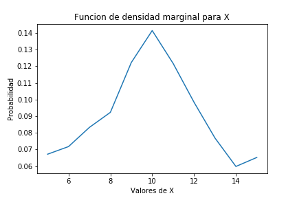
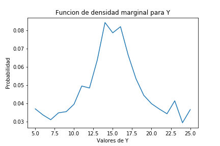
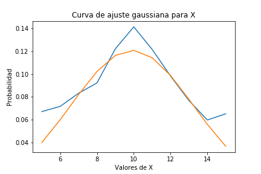
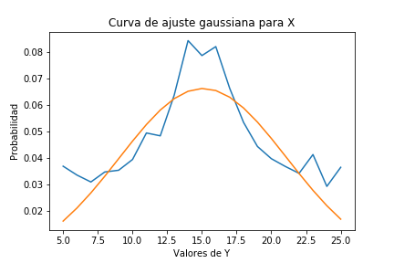
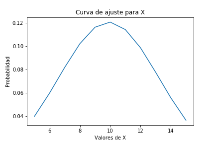
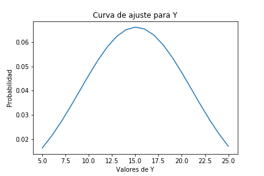
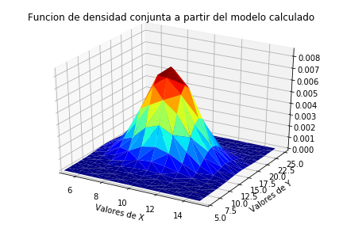

# Tarea3

Este proyecto corresponde a la **_Tarea 3_**, del curso de *IE0405 - Modelos Probabilísticos de Señales y Sistemas* desarrollado por  **Erick Sancho Abarca**, en el cual se trabaja sobre la  *_Variables aleatorias múltiples_*.

## 1. A partir de los datos, encontrar la mejor curva de ajuste (modelo probabilístico) para las funciones de densidad marginales de X y Y.

En este caso se calcula las funciones de densidad marginal de las variables **X** y **Y**, para ello primero se extrae los datos de las variables, empleando una función con la cual se extraen los datos del documento *xy.csv*, por lo tanto se creó una matriz con todos los datos del archivo *xy.csv*. Empleando la librería de numpy se empleó `np.array()`, para crear una matriz con los datos, esto para poder emplear los beneficios que otorga esta librería. Con la matriz se procedió a extraer los valores de las variables y almacenarlas en dos vectores, esto empleando las funciones creada para este propósito `separar()` y `separarletra()`, las cuales extraen los valores de las variables **X** y **Y**, con lo cual se puede calcular las funciones de densidad marginal y las curvas de mejor ajuste. 

Primero se graficaron las funciones de densidad de cada variable, esto empleando la función `pyplot` de la librería `matplotlib`, a partir del vector que define la los resultados de la función de densidad marginal, la cual se puede obtener empleando la siguiente ecuación:

Donde  es la variale para la cual se está calculando al funcion, y  es la segunda variable en este caso serían "x" y "y" o viceversa, dependiendo de la función que se esté calculando es ese momento. Entonces a partir de esta ecuación se obtuvo los vectores denominados `sumaX` y `sumaY`, de los cuales se calculó la función de densidad empleando la función `pyplot` llamada en el código como `plt`, y el resultado se muestra a continuación:

Para encontrar la curva de mejor ajuste de la función de densidad marginal para cada variable, se emplea la función `curve_fit` del módulo `scipy.optimize`, esta función toma como parámetros una función de **_Python_** que calcula la función con la que se desea comparar, y los valores de eje "x" y eje "y", de la función que se quiere ajustar, y devuelve los parámetros que posee la función que se ingresó para comparar. Entonces para obtener la curva de mejor ajuste se compara con las cuatro principales distribuciones las cuales son la "normal", "rayleigh", "exponencial" y "uniforme". Entonces de las gráficas se obtuvo que la curva que mejor se ajusta a esta distribución en ambos casos es la distribución normal. Entonces la distribución normal presenta las siguientes ecuaciones, para **X** y **Y**:

Entonces de la funcion `curve_fit()` se obtuvo que para la variable **X** los parametros 
 y  son: `[9.90484381 3.29944287]` 
 respectivamente. y Para la variable **Y** los parametros 
 y  son `[15.0794609   6.02693776]` respectivamente.
 Por lo tanto se obtuvieron las siguientes graficas con ajuste normal para las funciones de densidad marginal de las variables **X** y **Y**:

## 2. Asumir independencia de X y Y, ¿cuál es entonces la función de densidad conjunta que modela los datos?

En este caso se calcula la función de densidad conjunta de los datos, la cual es para dos variables una función en , donde la entrada son los posibles valores de **X** y **Y**, entonces para este caso dado que se suponen que las variables son independientes se puede emplear la siguiente igualdad la cual aplica para variables aleatorias independientes:

Entonces dado que en el punto anterior se tienen las funciones de densidad marginal se puede calcular la función de densidad conjunta como:

Entonces esta funcion se tiene la con los siguientes valores para la media y desviacion para el modelo obtenido del ajuste mediante la función `curve_fit` son para la variable *X* tenemos =9.90484381 aproximadamente y  =3.29944287 aproximadamente, y para la variable *Y* tenemos  =15.0794609 y  = 6.02693776 aproximadamente.

## 3. Hallar los valores de correlación, covarianza y coeficiente de correlación (Pearson) para los datos y explicar su significado a partir de los datos

Para esta seccion se comienza calculando la media de cada variable empleando la siguiente ecuación:

Y para la variable **Y** se emplea la siguiente ecuación:

Donde la *_p(x)_* y *_p(y)_* corresponde al vector que contiene los valores que toma la función de densidad marginal de **X** y **Y**, entonces a partir de estas ecuaciones obtuvimos que la media de **X** es aproximadamente 9.93536, y la media de **Y** es aproximadamente 15.04566. 

Ahora empleando las siguientes ecuaciones, se calcula la varianza de las variables **X** y **Y**:

De estas ecuaciones se obtuvo que la varianza de la variable  **X** es 4.73239 aproximadamente y la varianza para la variable **Y** es 7.81059 aproximadamente. Entonces ahora se calcula la desviación de cada variable, la cual se obtiene calculando la raíz cuadrada de la varianza, entonces se obtuvo para la variable **X** que la desviación es 2.1754057092873507, y para la variable **Y** la desviación es 2.794743279802279. 

Ahora se calcula la **correlación** de la variable aleatoria múltiple, la cual se obtiene como:

Entonces empleando un código de *Python* el cual recorre la matriz de valores de probabilidad y los vectores de valores de **X** y **Y**, se obtuvo que la correlación es de: 149.54281 aproximadamente. 

La correlación como su nombre nos parece decir es una medida de asociación de dos variables aleatorias múltiples, esto representa en alguna medida una intensidad en la relación lineal entre ellas, es decir si una de las variables aumenta la otra aumenta o disminuye su valor, lo cual definen relaciones positivas pendiente positiva o relaciones negativas pendiente negativa, en caso de ser cero se definen como ortogonales. Por lo tanto en este caso las variables no son ortogonales.

Ahora calculamos la **covarianza** de las variables **X** y **Y**, el cual se calcula como: 

La covarianza es un tipo de varianza entre dos variables, la cual en caso de ser positiva nos dice que la tendencia es positiva es decir son de relación directa, ambas variables crecen o decrecen a la vez, y en el caso de ser negativa, esta nos indica sobre una relación inversa entre las variables, es decir si una crece la otra decrece. Cuando la covarianza nos da un valor entorno a cero, esta nos indica que no existe alguna relación palpable entre las variables.

Para este caso tenemos que la covarianza es de 0.05876146240009916, este es un valor muy cercano a cero esto nos indica que no existe una relación palpable entre las variables.

Ahora calculamos el **coeficiente de Correlación (Pearson)**, el cual se calcula como:

El coeficiente de correlación lineal de Pearson, es un coeficiente que indica la correlación lineal de dos variables aleatorias, en otras palabras es una medida de la correlación, este no habla sobre la tendencia de los datos a una línea recta, este puede tomar valores de entre -1 y +1, donde -1 nos dice que los datos se alinean perfectamente en una recta con pendiente negativa y un 1 nos indica que los datos se alinean perfectamente en un línea recta con pendiente positiva, y cero nos indica que estos no presentan tendencia lineal. 

En este caso tenemos que se obtuvo un coeficiente de correlación línea de Pearson de 0.0096652 aproximadamente lo cual es muy cercano a cero por lo tanto se concluye que los datos no presentan una correlación lineal, y los datos no tienden a una línea recta, con esto se reafirma la independencia que existe entre ambas variables aleatorias.

## 4. Graficar las funciones de densidad marginales (2D), la función de densidad conjunta (3D).

En esta sección se trabaja en las gráficas de las funciones de densidad marginal y la densidad conjunta, entonces para las gráficas de la función de densidad marginal de las variables **X** y **Y**, empleando la libreria ` matplotlib.pyplot`, se obtuvieron las siguientes gráficas:

Ahora para realizar el gráfico de la función de densidad conjunta se emplearon las funciones:

~~~
import matplotlib.pyplot  as plt
from matplotlib import cm
~~~

Para poder graficar la función de densidad conjunta de los datos fue necesario emplear la configuración de los datos contenidos en el archivo `xyp.csv`, el cual contiene los mismos datos que el archivo `xy.csv`, pero en un formato de 3 columnas lo cual facilita la obtención de los datos de probabilidad necesarios para realizar el gráfico. Entonces a partir de estos valores de probabilidad se creó una lista la cual contiene los datos de probabilidad ordenados por filas, es decir los datos de la primera fila seguidos por los datos de la segunda fila, así hasta llegar a la última fila. Entonces con las funciones mencionadas se encontró que la gráfica para el modelo es la siguiente:

Ahora se gráfica la función de densidad conjunta a partir del modelo, para ello se implementó una función de *python* que recibe como parámetros los valores de x y y, y los valores de la media y la desviación calculadas con la función `curve_fit`. Con ello se creó el vector que contiene los valores de las probabilidades para cada par ordenado de valores de **X** y **Y**, y a partir de las mismas funciones con la que se calculó la gráfica anterior, se obtuvo la siguiente gráfica:

Como se puede apreciar en las gráficas anteriores, la gráfica del modelo concuerda muy bien con la forma de la gráfica obtenida de los datos, sin embargo varían en la magnitud esto se puede deber al ruido existente, por cómo se puede ver en la curva de mejor ajuste, no alcanza el valor máximo que posee la función de densidad marginal en ambas variables. Entonces podemos concluir que para este caso el modelo describe muy bien la forma de la distribución de los datos, sin embargo varia en la magnitud de las probabilidades que presentan los datos.
